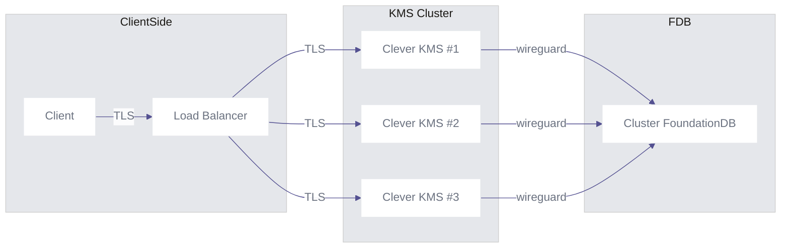

Several customers ask us for a solution to store and protect their secrets.

**Clever KMS** is the result of a long R&D phase that led to the revolutionary **Materia Architecture**.

It is built on top of the open-source transactional database [FoundationDB](https://www.foundationdb.org/), widely used by Apple to store their metadata, which gives us strong guarantees on data reliability and a full‑fledged transactional model, allowing us to create a serverless multi‑tenant database.

Our first concern is the security of your data.

To ensure this essential aspect, all data in transit is fully encrypted with TLS until it reaches one of the Clever KMS nodes, where TLS termination occurs. Each Clever KMS node is connected to FoundationDB through [WireGuard](https://www.wireguard.com/).

At rest, your data is stored inside FoundationDB using the state‑of‑the‑art cryptographic cipher [XChaCha20‑Poly1305](https://en.wikipedia.org/wiki/ChaCha20-Poly1305).

These combined measures ensure that your data is never accessible to third parties, either in transit or at rest.

Powered by Materia and modern cryptography, Clever KMS provides a secure, reliable, and resilient platform able to store your keys, certificates, and sensitive data.

Because of the distributed nature of Materia, your system is always up, which is crucial for a secrets‑management tool.





**Clever KMS is in Alpha testing phase:** your insights and suggestions are crucial in shaping the future of this platform. To share your feedback, please visit us at [our community page](https://github.com/CleverCloud/Community/discussions/categories/materia). Thank you for being part of our journey toward innovation and improvement!



## Create a Clever KMS add‑on

To create a Clever KMS, you will need a pair of tokens; we use [Biscuit](https://biscuitsec.org).

Please contact us and we will be happy to provide you access to our alpha program.

You will receive two tokens:

- **root token** — used for administrative tasks
- **user token** — for day‑to‑day tasks

The easiest way to interact with Clever KMS is by using the [Vault CLI](https://developer.hashicorp.com/vault/docs/commands), available in official HashiCorp Vault releases.

To connect to Clever KMS, you need to set its address in an environment variable.

```
export VAULT_ADDR="https://kms.eu-fr-1.services.clever-cloud.com:8200"
```

Once done, you are ready to create your vault.

To do this, connect with your **root token**; you will be prompted.

```
vault login
```

When you are ready, initialize your vault.

```
vault operator init
```

This will display your unseal shares.

```
Unseal Key 1: AQcEUzVTOmXm8O-lQavD4lCPKRTdXiwQAokb_uA2GjmJ
Unseal Key 2: AjoHPHK1ixLe5Dr9gV4STroKv_Kk3oHIQX_x-vAmo1xN
Unseal Key 3: A2GogTjZ617v85dV-C89TihYEV9C5AS8C3n1jz0aZCDC
Unseal Key 4: BPd1uTtjoel0VU4-Zkq3LSu_Dh89EgUsFKVhP_8fstSt
Unseal Key 5: BazaBHEPwaVFQuOWHzuYLbntoLLbKIBYXqNlSjIjdagi

Initial Root Token: XKvufz9aKdfnQg042uziwt2HuTtkqWRIjx-LLQrdRQY

Vault initialized with 5 key shares and a key threshold of 3. Please securely
distribute the key shares printed above. When the Vault is re-sealed,
restarted, or stopped, you must supply at least 3 of these keys to unseal it
before it can start servicing requests.

Vault does not store the generated root key. Without at least 3 keys to
reconstruct the root key, Vault will remain permanently sealed!

It is possible to generate new unseal keys, provided you have a quorum
of existing unseal keys shares. See "bao operator rotate-keys" for more
information.
```



These **Unseal Keys** are the only way to unseal your vault. If you lose the entire quorum required (here 3), you won't be able to unseal your vault again!



## Unseal a Clever KMS

You can't use your vault until you unseal it.

You will need a quorum of Unseal Keys previously generated during the init phase.

All following operations assume that you are connected with your **root token**.

You will be prompted for an Unseal Key.

```
vault operator unseal
Unseal Key (will be hidden):
```

This will summarize the state of the vault.

```
Key                Value
---                -----
Seal Type          n/a
Initialized        true
Sealed             true
Total Shares       5
Threshold          3
Unseal Progress    1/3
Unseal Nonce       n/a
Version            0.9.2
```

The current progress can be found in the "Unseal Progress" field.

Here we have provided 1 of the 3 required unseal keys.

You need to repeat the operation two more times to complete the unseal process.

If successful, the output of the last command will display the new "Sealed = false" state.

```
Key             Value
---             -----
Seal Type       n/a
Initialized     true
Sealed          false
Total Shares    5
Threshold       3
Version         0.9.2
```

Your vault is now able to handle requests.

## Seal a Clever KMS

At any time, if you own a **root token**, you can seal the vault.

```
vault operator seal
Success! Vault is sealed.
```

Once sealed, you are the person able to recover the situation by reapplying
the unsealing procedure with the same pool of unseal keys.

```
❯ vault status
Key                Value
---                -----
Seal Type          n/a
Initialized        true
Sealed             true
Total Shares       5
Threshold          3
Unseal Progress    0/3
```

## KV API

Allows you to store versioned secrets.

To perform these actions, we assume that you are logged in with the **user token**.

### Create a secret

```
vault kv put -mount=secret identity_user_1 firstname=John lastname=Doe
```

This will show you the data stored in the secret.

```
======= Secret Path =======
secret/data/identity_user_1

==== Metadata ====
Key          Value
---          -----
firstname    John
lastname     Doe
```

### Get a secret

To retrieve the secret:

```
vault kv get -mount=secret identity_user_1
```

As you can see, the secret is versioned.

```
======= Secret Path =======
secret/data/identity_user_1

========== Metadata ==========
Key                      Value
---                      -----
cas_required             false
creation_time            2025-11-28T18:16:38+00:00
custom_metadata          map[]
deleted_version_after    n/a
max_version              1
min_version              1
update_time              2025-11-28T18:16:38+00:00
version                  1

====== Data ======
Key          Value
---          -----
firstname    John
lastname     Doe
```

### Versioned secret

This means that you can update it.

```
vault kv put -mount=secret identity_user_1 firstname=John lastname=Doe phone=666
```

And get its new version:

```
❯ vault kv get -mount=secret identity_user_1
======= Secret Path =======
secret/data/identity_user_1

========== Metadata ==========
Key                      Value
---                      -----
cas_required             false
creation_time            2025-11-28T18:16:38+00:00
custom_metadata          map[]
deleted_version_after    n/a
max_version              2
min_version              1
update_time              2025-11-28T18:19:51+00:00
version                  2

====== Data ======
Key          Value
---          -----
firstname    John
lastname     Doe
phone        666
```

If you need to get a previous version, you can use the versioned API.

```
❯ vault kv get -version=1 -mount=secret identity_user_1
======= Secret Path =======
secret/data/identity_user_1

========== Metadata ==========
Key                      Value
---                      -----
cas_required             false
creation_time            2025-11-28T18:16:38+00:00
custom_metadata          map[]
deleted_version_after    n/a
max_version              2
min_version              1
update_time              2025-11-28T18:19:51+00:00
version                  1

====== Data ======
Key          Value
---          -----
firstname    John
lastname     Doe
```

### Delete/Undelete a secret

If a secret is no longer used but you still want to keep it,

you can mark the latest version of the secret as "deleted"; this doesn't remove it from storage but makes it invisible to get requests.

```
❯ vault kv delete -mount=secret identity_user_1
Success! Data deleted (if it existed) at: secret/data/identity_user_1
```

Now the remaining version is version 1:

```
❯ vault kv get -mount=secret identity_user_1
======= Secret Path =======
secret/data/identity_user_1

========== Metadata ==========
Key                      Value
---                      -----
cas_required             false
creation_time            2025-11-28T18:16:38+00:00
custom_metadata          map[]
deleted_version_after    n/a
max_version              2
min_version              1
update_time              2025-11-28T18:19:51+00:00
version                  1

====== Data ======
Key          Value
---          -----
firstname    John
lastname     Doe
```

Repeating the operation again will make the secret disappear from the get API.

```
❯ vault kv delete -mount=secret identity_user_1
Success! Data deleted (if it existed) at: secret/data/identity_user_1

❯ vault kv get -mount=secret identity_user_1
No value found at secret/data/identity_user_1
```

To reverse the operation, you can undelete a version:

```
❯ vault kv undelete -mount=secret -versions=2  identity_user_1
Success! Data written to: secret/undelete/identity_user_1

❯ vault kv get -version=1 -mount=secret identity_user_1
No value found at secret/data/identity_user_1

❯ vault kv get  -mount=secret identity_user_1
======= Secret Path =======
secret/data/identity_user_1

========== Metadata ==========
Key                      Value
---                      -----
cas_required             false
creation_time            2025-11-28T18:16:38+00:00
custom_metadata          map[]
deleted_version_after    n/a
max_version              2
min_version              1
update_time              2025-11-28T18:19:51+00:00
version                  2

====== Data ======
Key          Value
---          -----
firstname    John
lastname     Doe
phone        666
```

This will restore this specific version but not others.

### Destroy a secret

There is an irrevocable way to delete data from storage.



Once deleted, the secret version isn't recoverable!!



```
❯ vault kv destroy -mount=secret -versions=1 identity_user_1
Success! Data written to: secret/destroy/identity_user_1

❯ vault kv undelete -mount=secret -versions=1  identity_user_1
Success! Data written to: secret/undelete/identity_user_1

❯ vault kv get  -mount=secret -version=1 identity_user_1
No value found at secret/data/identity_user_1

❯ vault kv get  -mount=secret -version=2 identity_user_1
======= Secret Path =======
secret/data/identity_user_1

========== Metadata ==========
Key                      Value
---                      -----
cas_required             false
creation_time            2025-11-28T18:16:38+00:00
custom_metadata          map[]
deleted_version_after    n/a
max_version              2
min_version              2
update_time              2025-11-28T18:19:51+00:00
version                  2

====== Data ======
Key          Value
---          -----
firstname    John
lastname     Doe
phone        666
```

Version 1 can't be restored, but version 2 is still available and readable.

## Transit API

Create a secret in the secured KV to be used as an encrypting symmetric key.

### Create a transit key

A transit key is a named secret that allows you to encrypt data.

```
❯ vault write -f transit/keys/my-key
Success! Data written to: transit/keys/my-key
```

Here, we create a transit key called `my-key`.

### Encrypt a payload

Once the transit key `my-key` is created, it can be used to encrypt data.

All plaintext data must be base64‑encoded. This is because your payload can
be any binary data, not only text but also files (PDF, certificates, etc.).

```
❯ vault write transit/encrypt/my-key plaintext=$(echo "my secret data" | base64)
Key           Value
---           -----
ciphertext    vault:v1:ZsBtzrDN-aAWxeQ_phnFi64UI44k7ntdWqoK7jKFt7GEz3HUaxXVYTzKevS2HlosSWWN91Uv_aDFF4ID
```

The ciphertext isn't the same between two calls with the same payload.

```
❯ vault write transit/encrypt/my-key plaintext=$(echo "my secret data" | base64)
Key           Value
---           -----
ciphertext    vault:v1:75Le-Zs1fzJP-_l-vPdePoabvNXYGsBtcj0Ii4LcJ_eNHeImfNWz1aAH82uyPcGgyfExcyNk5Ds9lW-C
```

Making the ciphertext non‑predictable.

### Decrypt ciphertext

The ciphertext isn't stored by Clever KMS; it must be stored by the client
in its own datastore (not necessarily secured), along with the transit key name
used to generate the ciphertext.

```
❯ vault write transit/decrypt/my-key ciphertext=vault:v1:75Le-Zs1fzJP-_l-vPdePoabvNXYGsBtcj0Ii4LcJ_eNHeImfNWz1aAH82uyPcGgyfExcyNk5Ds9lW-C
Key          Value
---          -----
plaintext    bXkgc2VjcmV0IGRhdGEK
```

Decryption is stable even if the ciphertext looks totally different.

```
❯ vault write transit/decrypt/my-key ciphertext=vault:v1:ZsBtzrDN-aAWxeQ_phnFi64UI44k7ntdWqoK7jKFt7GEz3HUaxXVYTzKevS2HlosSWWN91Uv_aDFF4ID
Key          Value
---          -----
plaintext    bXkgc2VjcmV0IGRhdGEK
```

To get back the payload, base64‑decode it.

```
❯ base64 --decode <<< "bXkgc2VjcmV0IGRhdGEK"
my secret data
```

Be careful: keep the association between the ciphertext and the transit key used to create it.

With a non‑existent key:

```
❯ vault write transit/decrypt/not-existing ciphertext=vault:v1:ZsBtzrDN-aAWxeQ_phnFi64UI44k7ntdWqoK7jKFt7GEz3HUaxXVYTzKevS2HlosSWWN91Uv_aDFF4ID
Error writing data to transit/decrypt/not-existing: Error making API request.
                                                                                                                                                                                                                                    
URL: PUT http://localhost:8202/v1/transit/decrypt/not-existing                                                                                                                                                                      
Code: 400. Raw Message:                                                                                                                                                                                                              
                                                                                                                                                                                                                                    
"Unable to decrypt the secret" 
```

With an existing but different key:

```
❯ vault write transit/decrypt/my-key2 ciphertext=vault:v1:ZsBtzrDN-aAWxeQ_phnFi64UI44k7ntdWqoK7jKFt7GEz3HUaxXVYTzKevS2HlosSWWN91Uv_aDFF4ID
Error writing data to transit/decrypt/my-key2: Error making API request.
                                                                                                                                                                                                                                    
URL: PUT http://localhost:8202/v1/transit/decrypt/my-key2                                                                                                                                                                           
Code: 400. Raw Message:                                                                                                                                                                                                              
                                                                                                                                                                                                                                    
"Unable to decrypt the secret"  
```

This leaves very little hint for an enumeration attack.



If you lose the name of the transit key, your ciphertext isn't decryptable!!



### Rotate transit key

You may want to rotate transit keys for security reasons.

This will create a new version of the key.

If your key was created at version 1:

```
❯ vault write transit/encrypt/my-key plaintext=$(echo "my secret data" | base64)
Key           Value
---           -----
ciphertext    vault:v1:xLmLv2_uegkD0PSus6Efcp6Ie7CFNlU9wRPj0oXHb6rgtqRXa2FURPF_I3aYZay1td0LsjaDh4d2GsSz
```

The resulting ciphertext will be prefixed by "vault:v1".

If you rotate the transit key:

```
❯ vault write -f transit/keys/my-key/rotate
Success! Data written to: transit/keys/my-key/rotate
```

Your next call to the encrypt route with the rotated transit key:

```
❯ vault write transit/encrypt/my-key plaintext=$(echo "my secret data" | base64)
Key           Value
---           -----
ciphertext    vault:v2:GHyO4zNEHVr7ERW0FSwpFbdMDgQClX7qDekRNsngUd5r5hDW8pFGbQfHjDV-jgjRz7u1gECsoYe5Fw4C
```

Will now create a ciphertext prefixed by "vault:v2".

Both encrypted ciphertexts are decryptable, even if the key has been rotated.

```
❯ vault write transit/decrypt/my-key ciphertext=vault:v1:xLmLv2_uegkD0PSus6Efcp6Ie7CFNlU9wRPj0oXHb6rgtqRXa2FURPF_I3aYZay1td0LsjaDh4d2GsSz
Key          Value
---          -----
plaintext    bXkgc2VjcmV0IGRhdGEK

❯ vault write transit/decrypt/my-key ciphertext=vault:v2:GHyO4zNEHVr7ERW0FSwpFbdMDgQClX7qDekRNsngUd5r5hDW8pFGbQfHjDV-jgjRz7u1gECsoYe5Fw4C
Key          Value
---          -----
plaintext    bXkgc2VjcmV0IGRhdGEK
```

This allows you to smoothly handle the lifecycle of your secrets.

### Rewrap ciphertext with the latest transit key version

Rewrapping involves decrypting the v1 ciphertext and then encrypting to v2.

```
❯ vault write transit/rewrap/my-key ciphertext=vault:v1:xLmLv2_uegkD0PSus6Efcp6Ie7CFNlU9wRPj0oXHb6rgtqRXa2FURPF_I3aYZay1td0LsjaDh4d2GsSz
Key           Value
---           -----
ciphertext    vault:v2:JwgZBtUnHD9aJWDRlYz4s_RTt-Gw4nOiBT2PJc2Gxc12zp_YrZBVlEiSl00kzjYQqGJp8entrgFN0nrl
```

This rewrapped secret is now decrypted with version 2 of the transit key.

```
❯ vault write transit/decrypt/my-key ciphertext=vault:v2:JwgZBtUnHD9aJWDRlYz4s_RTt-Gw4nOiBT2PJc2Gxc12zp_YrZBVlEiSl00kzjYQqGJp8entrgFN0nrl
Key          Value
---          -----
plaintext    bXkgc2VjcmV0IGRhdGEK
```
